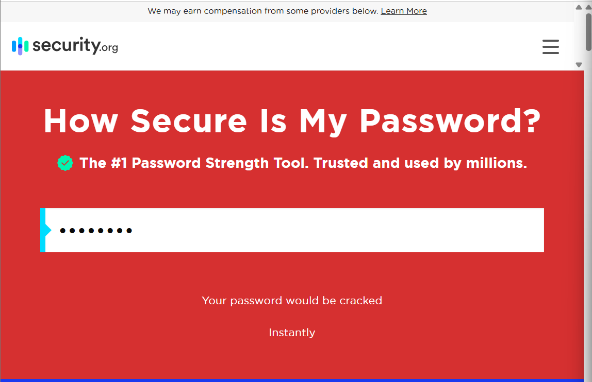
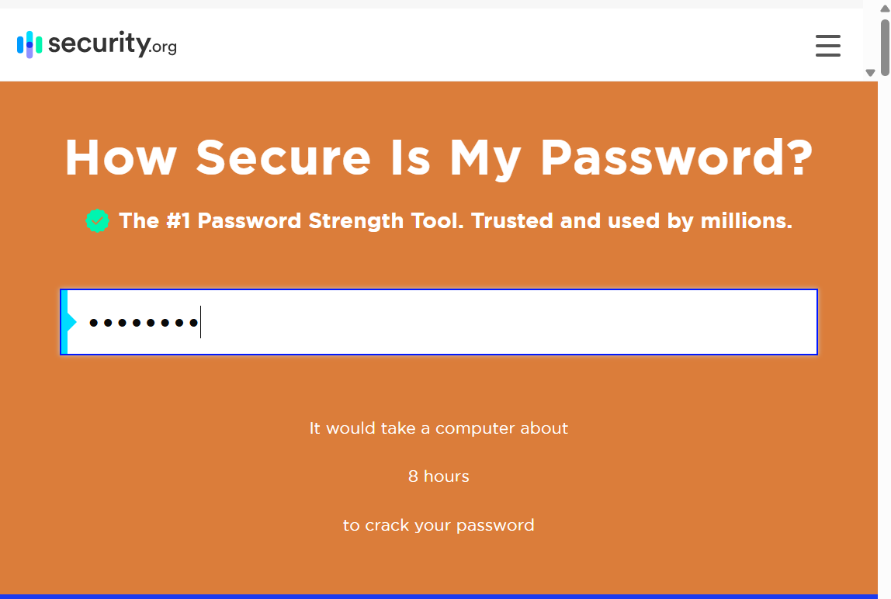
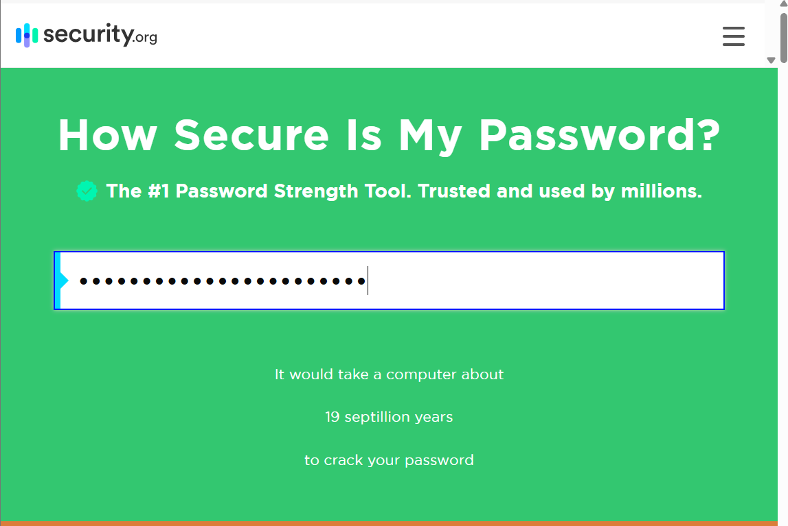
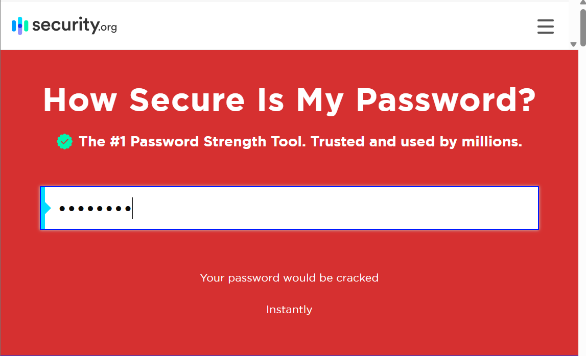

# 🔐 Cyber Security Internship – Task 6

## 🧠 Task: Create a Strong Password and Evaluate Its Strength

---

## 🎯 Objective

Understand what makes a password strong by testing multiple passwords using an online password strength checker and summarizing the results.

---

## 🛠️ Tool Used

- [https://howsecureismypassword.net](https://howsecureismypassword.net)

---

## 🔑 Passwords Tested

hello123

P@ssw0rd

GkT!z9Xb&Yv2

Sunshine_is_bright!2025

12345678

---

## 📸 Screenshots Details

All screenshots of password strength results are saved in the root folder.

---

### Password: hello123  

---

### Password: P@ssw0rd  

---

### Password: GkT!z9Xb&Yv2  

---

### Password: Sunshine_is_bright!2025  

---

### Password: 12345678  

---

## 🔍 Password Strength Analysis

### 1. `hello123`
- **HowSecure Result:** Cracked instantly  
- **Reason:** Simple, short, common word with digits.  
- **Conclusion:** ❌ Very weak password, easily guessable.

### 2. `P@ssw0rd`
- **HowSecure Result:** Cracked in a few minutes  
- **Reason:** Common password with simple symbol substitutions.  
- **Conclusion:** ⚠️ Weak, not recommended despite minor complexity.

### 3. `GkT!z9Xb&Yv2`
- **HowSecure Result:** Would take centuries to crack  
- **Reason:** Random, complex mix of uppercase, lowercase, symbols, and numbers.  
- **Conclusion:** ✅ Very strong and secure password.

### 4. `Sunshine_is_bright!2025`
- **HowSecure Result:** Would take centuries or more  
- **Reason:** Long passphrase with words, underscores, symbols, and digits.  
- **Conclusion:** ✅ Excellent balance of memorability and strength.

### 5. `12345678`
- **HowSecure Result:** Cracked instantly  
- **Reason:** One of the most common passwords ever used.  
- **Conclusion:** ❌ Extremely weak and highly vulnerable.

---

## ✅ Key Learnings

- Password length plays a critical role in strength.
- Use a combination of uppercase, lowercase, numbers, and special characters.
- Avoid dictionary words and common passwords, even with simple substitutions.
- Passphrases are effective — combining words and characters for strength and memorability.
- Online tools like howsecureismypassword.net are useful for assessing password strength.

---

## 🛡️ Best Practices for Strong Passwords

- Minimum 12–16 characters for better security.
- Mix character types: uppercase, lowercase, numbers, and symbols.
- Avoid common words, phrases, or easily guessable info like names or birthdays.
- Do not reuse passwords across different websites.
- Use a trusted password manager to generate and store complex passwords.
- Enable Multi-Factor Authentication (MFA) wherever possible.

---

## ⚔️ Common Password Attacks Explained

| Attack Type           | Description                                                                       |
|-----------------------|-----------------------------------------------------------------------------------|
| **Brute Force**       | Attempts every possible combination until it finds the correct password.          |
| **Dictionary Attack** | Uses a list of common words and passwords to guess passwords quickly.             |
| **Credential Stuffing** | Uses leaked username/password combos from one site to try on others.            |

---

## 🔐 What is Multi-Factor Authentication (MFA)?

MFA adds an extra layer of security by requiring two or more verification factors, such as:

- Something you know (password)
- Something you have (mobile phone, authenticator app)
- Something you are (biometrics)

This greatly reduces the risk of unauthorized access.

---

## ✅ Conclusion

This task reinforced the importance of strong passwords by testing various passwords and analyzing their strength. It highlighted the dangers of common passwords and the value of passphrases and complexity. Using tools like howsecureismypassword.net can help users understand and improve their password security. Implementing MFA and password managers further strengthens online security.

---

## 📂 Folder Structure

